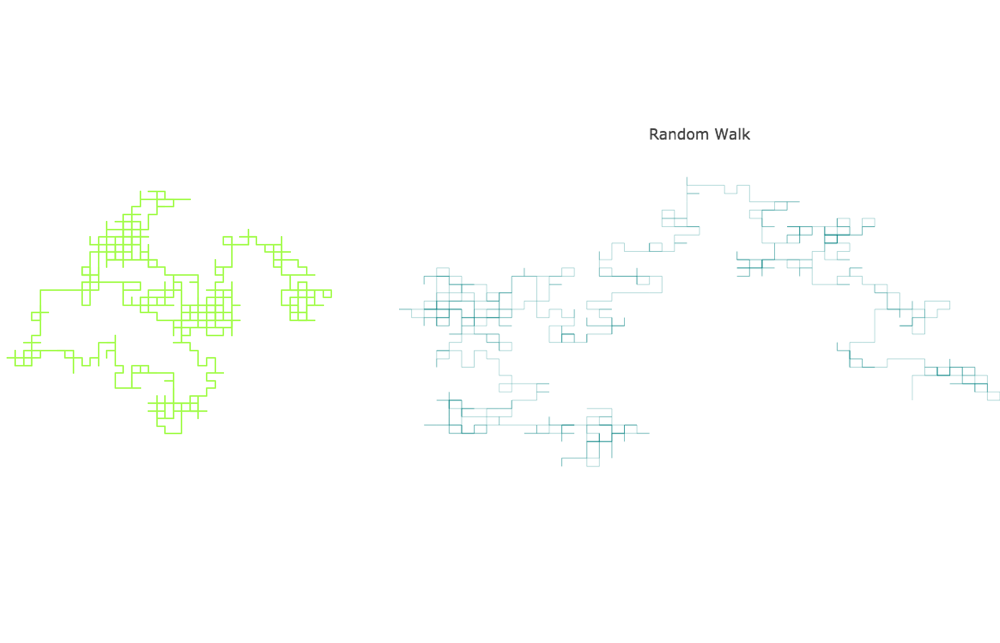

# Random Walk

Random Walk visualization tool made by David Kohler, designed for Python 3.6. For information on what a random walk is, and
its significance, visit [Wikipedia](https://en.wikipedia.org/wiki/Random_walk). This tool visualizes a random walk in 1D, 
2D, or 3D. The `random_walk.py` file uses Matplotlib to visualize the walk, while the `random_walk_plotly.py` file uses 
Plotly. In terms of which is better, it is up to personal preference. The programs will ask for the dimension of walk, 
number of steps in the walk, and number of walks to do. Each walk will be shown in a random color although this can easily
be changed within the code. This project was made to use a mathematical concept in an artistic sense to create interesting
visuals.

## Installation

1. Copy the repository 
2. Make sure you have Python version 3.6 or later
3. Run:

`pip install scipy`

`pip install seaborn`

`pip install plotly`

## Usage

From terminal usage: `random_walk.py`

or

usage: `random_walk_plotly.py`

Depending on whether you want to use matplotlib (first file) or plotly (second file) for visualization

## Example

Below is an example of 2D random walk of 1000 steps. The left from `random_walk.py` and the right from `random_walk_plotly.py`

## Authors

David Kohler

## License

This project is licensed under the MIT License - see the LICENSE.md file for details

